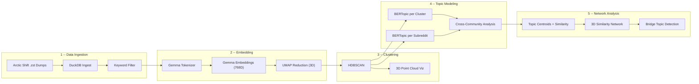

# Mapping AI Discourse on Reddit: Embedding, Clustering, and Topic Analysis at Scale

https://github.com/user-attachments/assets/33ac1296-fa5e-412f-992f-6d5387a75628

## Overview
This project originated as a group effort for INFO 256: Applied Natural Language Processing at UC Berkeley's School of Information. All pipeline code, analysis, and documentation in this repository represent my individual contributions. That said, no work exists in a vacuum--my teammates' ideas, feedback, and collaboration meaningfully shaped the direction and quality of what you see here.

We built an end-to-end NLP pipeline to analyze how artificial intelligence is discussed across Reddit communities. Starting from raw [Arctic Shift](https://github.com/ArthurHeitmann/arctic_shift) data dumps (compressed JSON archives of Reddit posts and comments), we ingested, filtered, embedded, clustered, and topic-modeled **2.4 million documents** spanning 20,000+ subreddits during July 2025.

The goal was to explore how AI-related discourse varies across online communities--which topics dominate, where communities converge on shared concerns, and where they diverge into distinct thematic niches. We used Google's Gemma embedding model to capture semantic meaning, HDBSCAN for density-based clustering in reduced-dimension space, and BERTopic to extract interpretable topics at both the cluster and subreddit level. The result is an interactive 3D map of Reddit's AI conversation landscape, along with cross-community analysis identifying "bridge topics" that span multiple communities.

## Pipeline Architecture



## Methodology

### 1. Data Collection and Ingestion

We sourced Reddit data from [Arctic Shift](https://github.com/ArthurHeitmann/arctic_shift), a publicly available archive of Reddit posts and comments stored as newline-delimited JSON in `.zst` compressed files. Our ingestion pipeline reads these archives directly into **DuckDB** (an in-process analytical database), filtering to a curated list of subreddits and applying deduplication via unique indexes. DuckDB's ability to query compressed JSON natively and its columnar storage made it well-suited for this scale of data.

### 2. Keyword Filtering

We applied a two-stage keyword filtering approach to isolate AI-related content:
- **Stage 1 (LIKE prefilter):** A fast SQL `LIKE` scan over subreddit names, post titles/selftext, and comment bodies to identify candidate rows
- **Stage 2 (Regex refinement):** Word-boundary regex matching against a curated term list to ensure precision

This two-pass strategy allowed us to process millions of rows efficiently -- the LIKE prefilter narrows the dataset cheaply before the more expensive regex pass runs on the reduced candidate set.

### 3. Tokenization and Embedding

We used Google's **Gemma** (`google/embeddinggemma-300m`) to produce 768-dimensional embeddings for each document:
- Text was first tokenized using the Gemma tokenizer (max 512 tokens)
- Token sequences were fed through the model with **mean pooling** over the last hidden states (weighted by attention masks) to produce a single dense vector per document
- We processed documents in batches of 64 with GPU acceleration, streaming results in 10,000-document chunks to manage memory

### 4. Dimensionality Reduction (UMAP)

We reduced the 768-dimensional Gemma embeddings to **3 dimensions** using UMAP (Uniform Manifold Approximation and Projection):
- A UMAP model was trained on a balanced sample of 100,000 documents (50K posts + 50K comments)
- The fitted model was then applied to transform all 2.4M+ documents
- Cosine distance was used as the metric, preserving the angular relationships that are meaningful in embedding space

### 5. Density-Based Clustering (HDBSCAN)

We applied **HDBSCAN** (Hierarchical Density-Based Spatial Clustering of Applications with Noise) to the 3D coordinates:
- `min_cluster_size=20`, `min_samples=10` -- tuned to capture both large thematic clusters and smaller niche communities
- HDBSCAN naturally handles noise points (documents that don't belong to any dense region), which accounted for ~71% of the dataset -- expected given the diversity of Reddit content
- The algorithm identified **5,374 clusters** of varying sizes

### 6. Topic Modeling (BERTopic)

We trained **BERTopic** models at two levels of granularity:
- **Per cluster** (20 top clusters): Using the original 768D Gemma embeddings as input to BERTopic, allowing it to discover sub-topics within each cluster
- **Per subreddit** (50 top subreddits): Training separate models per community to capture subreddit-specific discourse patterns

BERTopic was configured with:
- Class-based TF-IDF with BM25 weighting for topic representation
- Maximal Marginal Relevance for diverse keyword selection
- N-gram range (1, 3) to capture multi-word expressions

This produced **4,622 total topics** (742 from cluster models + 3,880 from subreddit models).

### 7. Cross-Community and Network Analysis

We computed topic centroids (mean Gemma embeddings per topic, L2-normalized) and built a similarity network:
- **Cosine similarity** between all 4,622 topic centroids identified semantically related topics across different communities
- **Bridge topics** were detected -- topics that connect 3+ distinct subreddits with high similarity, revealing shared cross-community concerns
- **Topic reach scores** quantified how broadly each topic resonates across the Reddit landscape
- An interactive **3D similarity network** was built using Plotly, where subreddits are positioned by force-directed layout and colored by their dominant HDBSCAN cluster

## Key Results

| Metric | Value |
|--------|-------|
| Total documents processed | 2,446,842 |
| Unique subreddits | 20,635 |
| HDBSCAN clusters | 5,374 |
| Cluster models trained | 20 |
| Subreddit models trained | 50 |
| Total topics discovered | 4,622 |
| Noise points (unclustered) | 1,735,721 (~71%) |

### Observations

- **Cluster diversity varies significantly.** Some clusters (e.g., those with diversity scores > 0.9) draw from many subreddits, suggesting broad, cross-community themes. Others (diversity < 0.3) are dominated by a single subreddit, indicating community-specific discourse.
- **Subreddits partition cleanly into thematic regions** in the 3D embedding space. The animated visualization reveals that as we add subreddits by frequency rank, they tend to "fill in" distinct spatial regions rather than overlapping uniformly.
- **Bridge topics reveal shared concerns.** Topics around AI safety, job displacement, and model capabilities appear across technically-focused subreddits, general discussion forums, and domain-specific communities alike.
- **The two-level modeling approach (cluster + subreddit) captures different aspects of the discourse.** Cluster-level topics reflect broad thematic groupings that cross community boundaries, while subreddit-level topics capture the specific framing and vocabulary each community uses.

**Example: r/aiArt in the 3D Subreddit Similarity Network**


*Each node is a subreddit positioned by its UMAP-reduced topic centroid, colored by dominant HDBSCAN cluster. The hover panel shows r/aiArt's topic overlap with its most similar communities.*

## Tech Stack

| Category | Tools |
|----------|-------|
| Database | DuckDB |
| Embeddings | Google Gemma (embeddinggemma-300m), HuggingFace Transformers |
| Dimensionality Reduction | UMAP |
| Clustering | HDBSCAN |
| Topic Modeling | BERTopic |
| Visualization | PyVista (3D point clouds), Plotly (interactive networks), Matplotlib/Seaborn |
| Graph Analysis | NetworkX |
| Data Processing | Pandas, NumPy, PyArrow |

## Repository Structure

```
reddit-ai-analysis-showcase/
├── README.md
├── LICENSE
├── requirements.txt
├── config.template.yaml
├── assets/
│   └── subreddit_similarity_network.png
├── pipeline/                        # Data ingestion and preprocessing
│   ├── 01_init_database.py          # Initialize DuckDB schema
│   ├── 02_seed_subreddits.py        # Seed valid subreddit list
│   ├── 03_ingest_data.py            # Ingest Arctic Shift .zst dumps
│   ├── 04_add_indexes.py            # Add unique indexes
│   ├── 05_keyword_filter.py         # Two-stage AI keyword filtering
│   ├── 06_tokenize.py               # Gemma tokenization
│   ├── 07_generate_embeddings.py    # 768D Gemma embeddings
│   └── 08_reduce_dimensions.py      # UMAP 768D -> 3D
├── clustering/                      # Density-based clustering
│   ├── 09_hdbscan_cluster.py        # HDBSCAN on 3D embeddings
│   └── 10_cluster_visualization.py  # Interactive PyVista 3D viz
├── topic_modeling/                  # BERTopic analysis
│   ├── 11_data_integration.py       # Merge embeddings, clusters, text
│   ├── 12_bertopic_modeling.py      # Train per-cluster and per-subreddit models
│   ├── 13_comparison_analysis.py    # Topic overlap, diversity scores
│   └── 14_run_analysis.py           # Orchestrator script
├── network_analysis/                # Cross-community analysis
│   ├── 15_compute_centroids.py      # Topic centroid embeddings + UMAP 3D
│   ├── 16_interactive_topic_space.py # Plotly 3D topic visualization
│   ├── 17_cross_community.py        # Bridge topics, reach scores
│   ├── 18_similarity_network.py     # 3D subreddit similarity network
│   └── 19_dominant_topics.py        # Dominant topic per subreddit
└── animation/
    └── generate_cluster_animation.py # Rotating 3D GIF generator
```

## How to Replicate

### 1. Get the Data

Download Reddit dumps from [Arctic Shift](https://github.com/ArthurHeitmann/arctic_shift). We used the July 2025 monthly archives (`RC_2025-07.zst` for comments, `RS_2025-07.zst` for posts).

### 2. Configure

Copy `config.template.yaml` to `config.yaml` and fill in your local paths:
- Where your `.zst` dump files live
- Where DuckDB databases should be created
- A text file listing subreddits to include (one per line)
- A file containing your keyword terms for filtering

### 3. Run the Pipeline

Execute scripts in numbered order. Each stage reads from the previous stage's output:

```bash
# Stage 1: Ingest
python pipeline/01_init_database.py
python pipeline/02_seed_subreddits.py
python pipeline/03_ingest_data.py --mode comments
python pipeline/03_ingest_data.py --mode posts
python pipeline/04_add_indexes.py

# Stage 2: Filter and embed
python pipeline/05_keyword_filter.py
python pipeline/06_tokenize.py
python pipeline/07_generate_embeddings.py
python pipeline/08_reduce_dimensions.py

# Stage 3: Cluster
python clustering/09_hdbscan_cluster.py
python clustering/10_cluster_visualization.py

# Stage 4: Topic model
python topic_modeling/14_run_analysis.py

# Stage 5: Network analysis
python network_analysis/15_compute_centroids.py
python network_analysis/16_interactive_topic_space.py
python network_analysis/17_cross_community.py
python network_analysis/18_similarity_network.py
python network_analysis/19_dominant_topics.py

# Generate animation
python animation/generate_cluster_animation.py
```

### 4. Requirements

```bash
pip install -r requirements.txt
```

A CUDA-capable GPU is recommended for the embedding generation stage (Step 07) but the pipeline will fall back to CPU automatically.

## Data Attribution

Reddit data sourced from [Arctic Shift](https://github.com/ArthurHeitmann/arctic_shift), a community-maintained archive of public Reddit data.

## License

This project is released under the [MIT License](LICENSE). The analysis pipeline is original work; the underlying Reddit data is subject to Reddit's terms of service and Arctic Shift's data policies.

